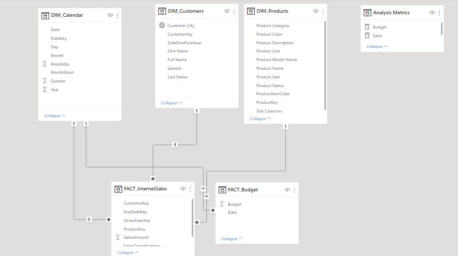
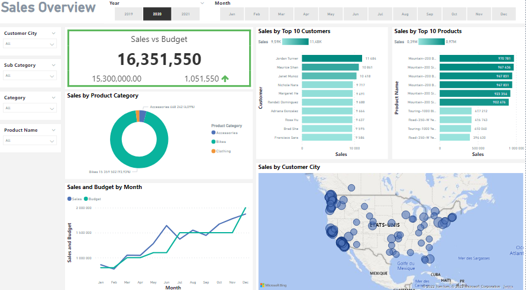

<h1 align="center">Sales Analysis Project using Sql Server and Power BI</h1>


## Data Cleansing & Transformation (SQL)

To create the necessary data model for doing analysis and fulfilling the business needs defined in the user stories the following tables were extracted using SQL.

One data source (sales budgets) were provided in Excel format and were connected in the data model in a later step of the process.

Below are the SQL statements for cleansing and transforming necessary data.


## Look up Table_Calendar:

```
-- Cleansed DIM_Date Table --

SELECT 
  [DateKey], 
  [FullDateAlternateKey] AS Date, 
  [EnglishDayNameOfWeek] AS Day, 
  [EnglishMonthName] AS Month, 
  Left([EnglishMonthName], 3) AS MonthShort,-- Useful for front end date navigation and front end graphs.
  [MonthNumberOfYear] AS MonthNo, 
  [CalendarQuarter] AS Quarter, 
  [CalendarYear] AS Year ,
  
FROM 
 [AdventureWorksDW2019].[dbo].[DimDate]
WHERE 
  CalendarYear >= 2019
```
  

## Look up Table_Customers:

```
-- Cleansed DIM_Customers Table --

SELECT 
  c.customerkey AS CustomerKey, 
  c.firstname AS [First Name], 
  c.lastname AS [Last Name], 
  c.firstname + ' ' + lastname AS [Full Name], 
  CASE c.gender WHEN 'M' THEN 'Male' WHEN 'F' THEN 'Female' END AS Gender,
  c.datefirstpurchase AS DateFirstPurchase, 
  g.city AS [Customer City] -- Joined in Customer City from Geography Table
FROM 
  [AdventureWorksDW2019].[dbo].[DimCustomer] as c
  LEFT JOIN dbo.dimgeography AS g ON g.geographykey = c.geographykey 
ORDER BY 
  CustomerKey ASC -- Ordered List by CustomerKey
  ```
  
## Look up Table _Products:
  
  ```
-- Cleansed DIM_Products Table --

SELECT 
    p.[ProductKey], 
    p.[ProductAlternateKey] AS ProductItemCode, 
    p.[EnglishProductName] AS [Product Name], 
    ps.EnglishProductSubcategoryName AS [Sub Category], -- Joined in from Sub Category Table
    pc.EnglishProductCategoryName AS [Product Category], -- Joined in from Category Table
    p.[Color] AS [Product Color], 
    p.[Size] AS [Product Size], 
    p.[ProductLine] AS [Product Line], 
    p.[ModelName] AS [Product Model Name], 
    p.[EnglishDescription] AS [Product Description], 
  ISNULL (p.Status, 'Outdated') AS [Product Status] ,
FROM 
    [AdventureWorksDW2019].[dbo].[DimProduct] as p
    LEFT JOIN dbo.DimProductSubcategory AS ps ON ps.ProductSubcategoryKey = p.ProductSubcategoryKey 
    LEFT JOIN dbo.DimProductCategory AS pc ON ps.ProductCategoryKey = pc.ProductCategoryKey 
order by 
    p.ProductKey asc
```
    
 ## FACT Table_Internet Sales:
 
    
  ```
-- Cleansed FACT_InternetSales Table --

SELECT 
    [ProductKey], 
    [OrderDateKey], 
    [DueDateKey], 
    [ShipDateKey], 
    [CustomerKey], 
    [SalesOrderNumber], 
    [SalesAmount] ,
FROM 
    [AdventureWorksDW2019].[dbo].[FactInternetSales]
WHERE 
    LEFT (OrderDateKey, 4) >= YEAR(GETDATE()) -2 -- Ensures we always only bring two years of date from extraction.
ORDER BY
  OrderDateKey ASC
   ```
   
## Data Model

Below is a screenshot of the data model after cleansed and prepared tables were read into Power BI.

This data model also shows how FACT_Budget hsa been connected to FACT_InternetSales and other necessary DIM tables.



## Sales Management Dashboard

The finished sales management dashboard with one page with works as a dashboard and overview, with two other pages focused on combining tables for necessary details and visualizations to show sales over time, per customers and per products.





#  
